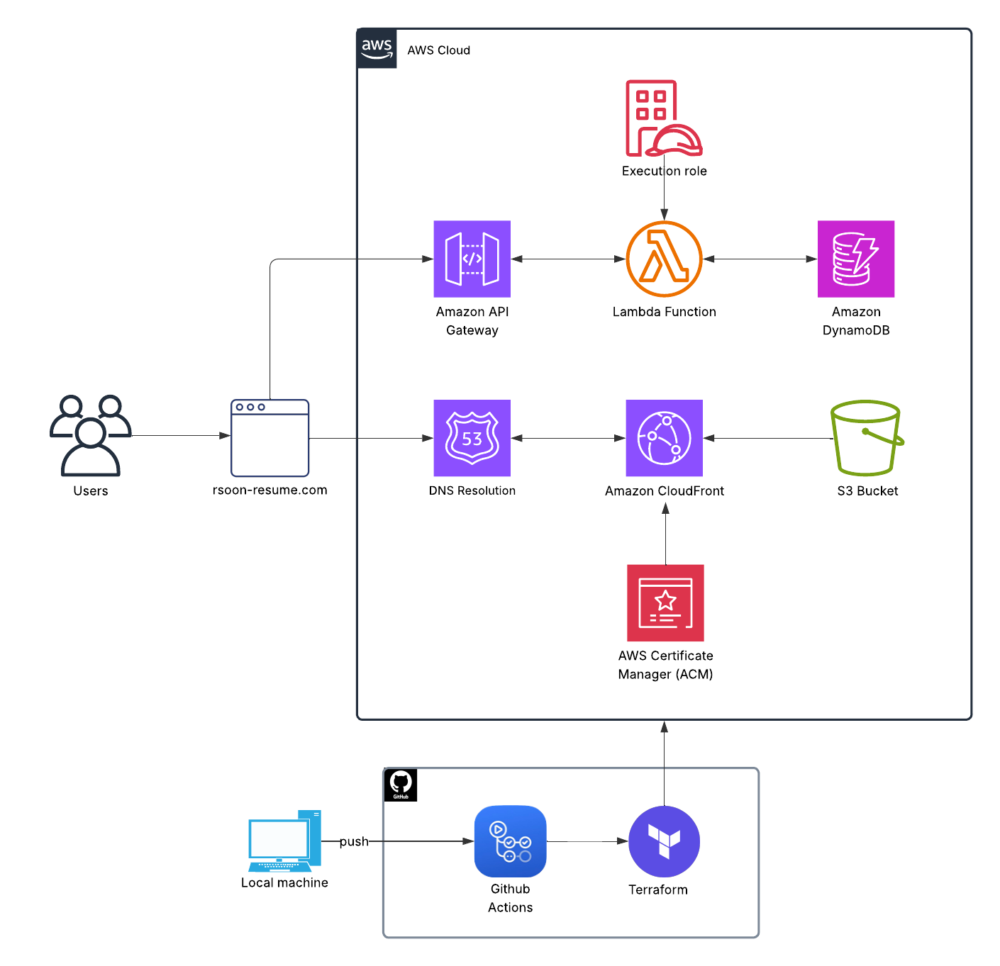

# Cloud Resume Project

## Overview
This is my attempt at the Cloud Resume Challenge by Forrest Brazeal. I used AWS as my cloud service provider. 
I took on this project because I wanted to accrue hands-on experience with AWS services and exhibit my IaC skills. 

You can visit the final product here: [rsoon-resume.com](https://rsoon-resume.com)

### Prerequisite 
Prior to this challenge, I earned the AWS SAA-CO3 certification. 

## Architecture

Technologies/Services used:
- R53 for DNS
- ACM for SSL/TLS cert
- CloudFront for HTTPS + content delivery network
- S3 for SPA hosting and backend tfstate
- API Gateway + Lambda for backend hit counter
- DynamoDB for persistent storage on hit counter value
- Terraform for IaC
- Github Actions for frontend and backend CI/CD pipelines
- Playwright for backend testing

## Deployment
Infrastructure is provisioned via Terraform on every push. CI/CD pipelines handle deployments to the frontend (S3) and backend. Playwright tests are run automatically after deployment. Secrets are handled via OIDC during this process. 

